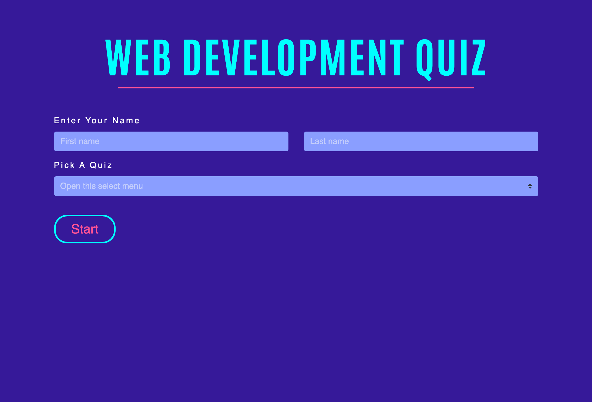
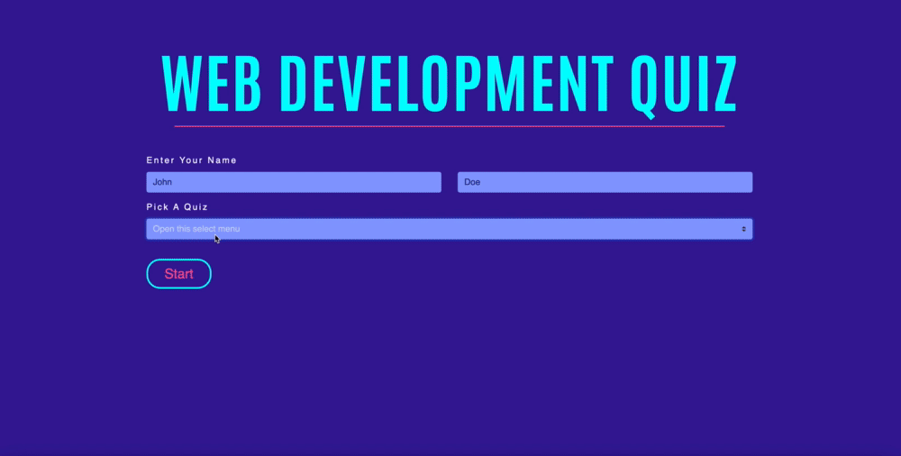

# Project3-Quiz
<b> Link to site: </b> https://spa-quiz.netlify.app/

## Preview
   

## About
<b>Web Development Quiz</b> is a set of two beginner practice quizzes for upcoming web developers. 
  
<b>Quiz One:</b>  HTML, CSS, Javascript, Bootstrap
 
<b>Quiz Two:</b> Pyton, JQuery, SQL, Java

## Technologies 

&nbsp; &nbsp;
 &nbsp; &nbsp; &nbsp;